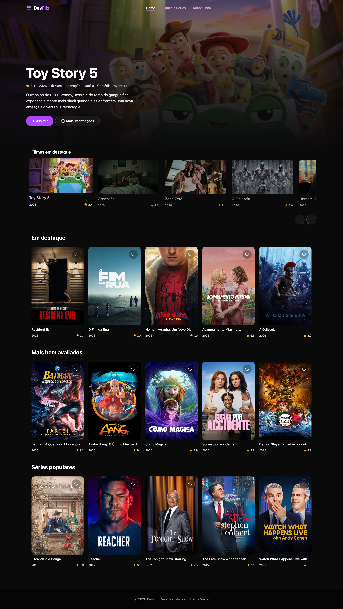
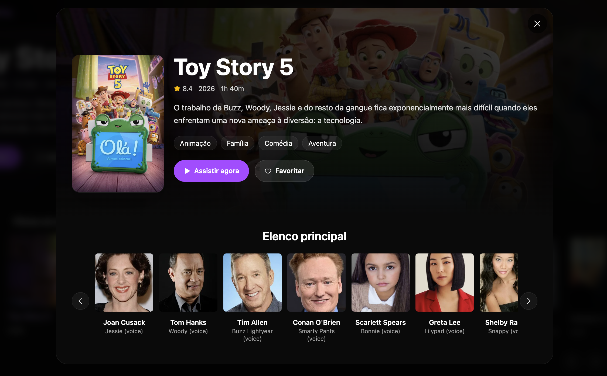
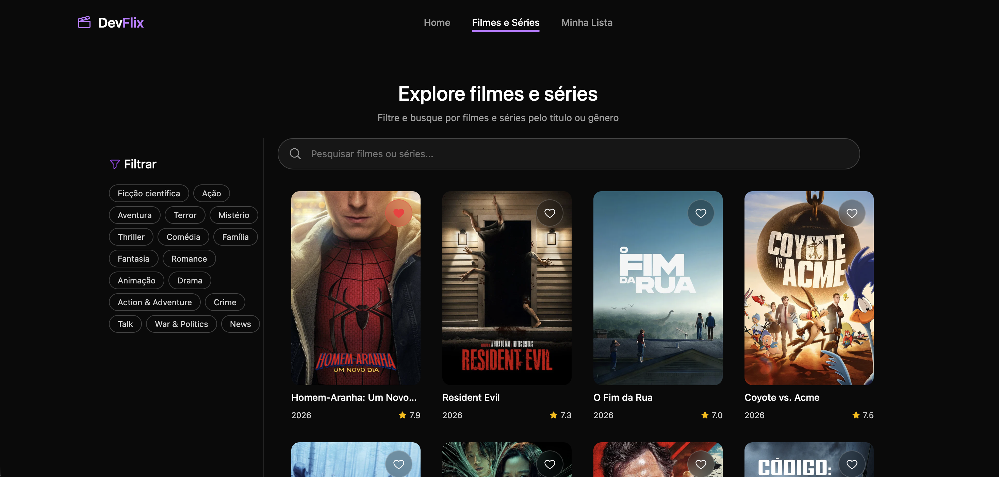
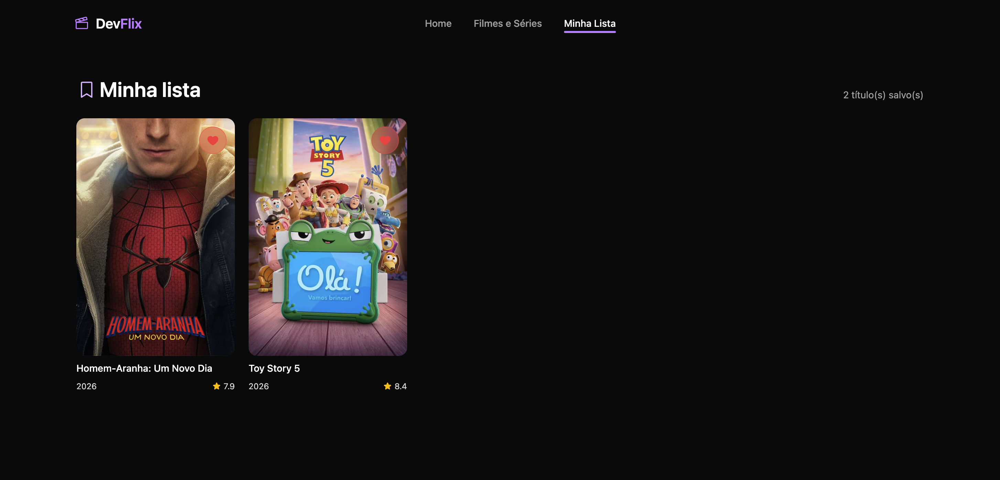

# 🎬 DevFlix

> Catálogo de filmes e séries inspirado nos streamings, feito com **React + TypeScript + Tailwind CSS** e consumindo dados reais da **API do TMDB** (The Movie Database).

Projeto criado para um **workshop de React**: além de ser uma aplicação funcional, o código serve como material de estudo dos principais conceitos da biblioteca.



---

## 📑 Sumário

- [Funcionalidades](#-funcionalidades)
- [Telas](#️-telas)
- [Tecnologias](#-tecnologias)
- [Como rodar o projeto](#-como-rodar-o-projeto)
- [Estrutura de pastas](#-estrutura-de-pastas)
- [Como o sistema funciona](#-como-o-sistema-funciona)
- [Mini guia de React (conceitos usados no projeto)](#-mini-guia-de-react)
- [Guia da API do TMDB](#-guia-da-api-do-tmdb)
- [Materiais extras](#-materiais-extras)
- [Autoria](#-autoria)

---

## ✨ Funcionalidades

- **Banner principal (hero)** com o filme em destaque, que troca sozinho a cada 10 segundos.
- **Carrossel "Filmes em destaque"** com os 10 filmes mais bem avaliados entre os populares, com navegação por setas.
- **Seções da Home**: *Em destaque* (tendências da semana), *Mais bem avaliados* e *Séries populares*.
- **Modal de detalhes** com sinopse, duração, gêneros, nota, elenco (com fotos) e link para o **trailer no YouTube**.
- **Página Explorar** (`#/explore`): busca por título direto na API (com *debounce*) e **filtro por múltiplas categorias** (gêneros).
- **Minha Lista** (`#/favorites`): favoritos salvos no `localStorage`, sincronizados entre componentes e entre abas do navegador.
- **Layout responsivo**, com menu mobile e header que muda de estilo ao rolar a página.
- Estados de **carregando**, **erro** (ex.: chave da API ausente) e **lista vazia**.

---

## 🖥️ Telas

### Modal de detalhes

Abre ao clicar em **Mais informações** ou em qualquer pôster. Mostra sinopse, nota, ano, duração, gêneros, botão para o trailer, botão de favoritar e o carrossel com o elenco principal.



### Explorar filmes e séries

Rota `#/explore`. Busca por título na API do TMDB e filtra por um ou mais gêneros ao mesmo tempo.



### Minha Lista

Rota `#/favorites`. Mostra os títulos favoritados, que ficam salvos no `localStorage` do navegador.



---

## 🛠 Tecnologias

| Tecnologia | Uso no projeto |
| :--- | :--- |
| [React 19](https://react.dev/) | Biblioteca de interface |
| [TypeScript](https://www.typescriptlang.org/) | Tipagem estática |
| [Vite](https://vite.dev/) | Servidor de desenvolvimento e build |
| [Tailwind CSS 4](https://tailwindcss.com/) | Estilização com classes utilitárias |
| [Axios](https://axios-http.com/) | Requisições HTTP para a API |
| [Phosphor Icons](https://phosphoricons.com/) | Ícones |
| [TMDB API](https://developer.themoviedb.org/) | Fonte dos dados de filmes e séries |
| ESLint | Padronização do código |

---

## 🚀 Como rodar o projeto

### Pré-requisitos

- [Node.js](https://nodejs.org/) 20 ou superior
- Uma conta gratuita no [TMDB](https://www.themoviedb.org/signup) para gerar a chave da API (passo a passo [aqui](#1-criando-sua-chave))

### Passo a passo

```bash
# 1. Clone o repositório
git clone https://github.com/eduardavieira-dev/DevFlix-workshop.git
cd DevFlix-workshop

# 2. Instale as dependências
npm install

# 3. Crie o arquivo de variáveis de ambiente
cp .env.example .env
```

Abra o `.env` e preencha com a sua chave:

```env
VITE_TMDB_API_KEY=sua_chave_aqui
VITE_TMDB_READ_ACCESS_TOKEN=
VITE_TMDB_LANGUAGE=pt-BR
```

| Variável | Obrigatória? | Descrição |
| :--- | :---: | :--- |
| `VITE_TMDB_API_KEY` | Sim* | Chave da API (v3), enviada como `?api_key=` |
| `VITE_TMDB_READ_ACCESS_TOKEN` | Sim* | Token de leitura (v4), enviado como `Authorization: Bearer`. Se preenchido, tem prioridade |
| `VITE_TMDB_LANGUAGE` | Não | Idioma dos resultados (padrão `pt-BR`) |

\* Basta **uma** das duas.

> ⚠️ No Vite, só variáveis que começam com `VITE_` ficam disponíveis no front-end (via `import.meta.env`). O `.env` já está no `.gitignore`, então **nunca suba sua chave** para o GitHub.

```bash
# 4. Rode o projeto
npm run dev
```

Acesse **http://localhost:5173**.

### Scripts disponíveis

| Comando | O que faz |
| :--- | :--- |
| `npm run dev` | Inicia o servidor de desenvolvimento |
| `npm run build` | Checa os tipos e gera a versão de produção em `dist/` |
| `npm run preview` | Serve localmente o build de produção |
| `npm run lint` | Roda o ESLint |

---

## 📁 Estrutura de pastas

```text
src/
├── main.tsx                 # Ponto de entrada: monta o <App /> no #root
├── App.tsx                  # Busca as seções da Home e decide qual "página" mostrar
├── App.css                  # Tailwind + tema (cores, utilitários)
│
├── components/              # Peças reutilizáveis da interface
│   ├── Header/              # Navegação, menu mobile, efeito ao rolar
│   ├── Background/          # Hero com o filme em destaque
│   ├── Carousel/            # Carrossel horizontal de destaques
│   ├── Card/                # Card usado no carrossel
│   ├── Banner/              # Pôster com botão de favoritar
│   ├── MovieSection/        # Seção com título + lista de Banners
│   ├── Modal/               # Detalhes, elenco e trailer
│   ├── Explore/             # Busca + filtros + grade de resultados
│   │   └── _components/     # Subcomponentes usados só pelo Explore
│   │       ├── SearchInput/
│   │       └── Filter/
│   └── Footer/
│
├── pages/                   # Telas completas
│   ├── Search/              # Rota #/explore
│   └── Favorites/           # Rota #/favorites
│
├── hooks/
│   └── useMovieCatalog.ts   # Hook customizado com todo o estado do catálogo
│
├── services/
│   └── tmdb.ts              # Toda a comunicação com a API do TMDB
│
├── utils/
│   ├── movieCatalog.ts      # Funções puras: destaques, categorias, filtros
│   └── favorites.ts         # Leitura/escrita dos favoritos no localStorage
│
└── types/
    └── filme.ts             # Tipos Filme e CastMember
```

Cada camada tem uma responsabilidade:

- **services** → *fala com a API* e converte o formato do TMDB para o formato do app.
- **utils** → *funções puras*, sem React, fáceis de testar.
- **hooks** → *guarda o estado* e junta services + utils.
- **components/pages** → *só exibem* dados e avisam quando o usuário interage.

---

## ⚙️ Como o sistema funciona

```text
         TMDB API
            ▲
            │  axios (services/tmdb.ts)
            │  - injeta a chave automaticamente
            │  - converte TmdbMovie → Filme
            │
   hooks/useMovieCatalog.ts ──────► utils/movieCatalog.ts
   (estado: filmes, busca,           (destaques, categorias,
    categorias, modal...)             filtros)
            │
            ▼
         App.tsx  ──  lê window.location.hash e escolhe a tela
            │
   ┌────────┼──────────────┐
   ▼        ▼              ▼
  Home   #/explore     #/favorites
            │              │
            └──── Modal ◄──┘ (abre em qualquer tela)
                    │
          utils/favorites.ts ◄──► localStorage
```

1. Ao abrir o app, o hook `useMovieCatalog` chama `fetchPopularMovies()` (filmes + séries populares) e escolhe o filme mais bem avaliado para o hero.
2. Em paralelo, o `App` busca as seções *Em destaque*, *Mais bem avaliados* e *Séries populares* com `Promise.all`.
3. Os primeiros itens são "enriquecidos" em segundo plano com `fetchMovieDetails()` (duração, elenco e trailer).
4. Ao clicar em **Mais informações**, o modal abre na hora com os dados básicos e é atualizado quando os detalhes chegam.
5. Na página Explorar, digitar 2 ou mais letras dispara uma busca na API 350 ms depois da última tecla (*debounce*). Os resultados passam pelo filtro de categorias.
6. Favoritar salva o filme no `localStorage` e dispara o evento `devflix:favorites-updated`, e todos os corações da tela se atualizam.

**Roteamento:** o projeto não usa biblioteca de rotas. O `App` escuta o evento `hashchange` e renderiza a tela de acordo com o hash da URL (`#/`, `#/explore`, `#/favorites`). É uma forma simples de mostrar como um roteador funciona por dentro.

---

## ⚛️ Mini guia de React

Esta seção explica os conceitos de React usados no DevFlix, sempre com exemplos tirados do próprio projeto.

### 1. Componentes

Um componente é uma **função que retorna JSX** (um HTML dentro do JavaScript). Nomes de componentes começam com letra maiúscula.

```tsx
// src/components/Footer/page.tsx (simplificado)
export function Footer() {
  return (
    <footer className="py-6 text-center text-sm text-neutral-400">
      © 2026 DevFlix. Desenvolvido por Eduarda Vieira
    </footer>
  )
}
```

E é usado como uma tag: `<Footer />`.

### 2. JSX

Regras que aparecem o tempo todo no projeto:

- `className` no lugar de `class`.
- `{ }` para colocar JavaScript no meio do HTML: `<h1>{filme.title}</h1>`.
- Um componente retorna **um único elemento pai**. Quando não queremos uma `div` a mais, usamos o **Fragment** `<> ... </>` (veja o `App.tsx`).

### 3. Props

Props são os **parâmetros** de um componente. Com TypeScript, descrevemos o formato delas com um `type`:

```tsx
// src/components/Background/page.tsx
type BackgroundProps = {
  filme: Filme
  onOpenDetails: (filme: Filme) => void
}

export function Background({ filme, onOpenDetails }: BackgroundProps) {
  return (
    <section>
      <h1>{filme.title}</h1>
      <button onClick={() => onOpenDetails(filme)}>Mais informações</button>
    </section>
  )
}
```

Os dados **descem** pelas props (`filme`) e os eventos **sobem** por funções recebidas via props (`onOpenDetails`).

### 4. Estado com `useState`

Estado é um valor que, quando muda, faz o React **renderizar o componente de novo**.

```tsx
// src/components/Header/page.tsx
const [menuOpen, setMenuOpen] = useState(false)

<button onClick={() => setMenuOpen(!menuOpen)}>Menu</button>
```

**Atualização funcional:** quando o novo valor depende do anterior, passamos uma função para o `set`. Assim o React sempre usa o valor mais recente:

```ts
// src/hooks/useMovieCatalog.ts
function alternarCategoria(categoria: string) {
  setCategoriasSelecionadas((prev) =>
    prev.includes(categoria)
      ? prev.filter((item) => item !== categoria) // remove
      : [...prev, categoria]                      // adiciona
  )
}
```

> 💡 Nunca altere o estado diretamente (`prev.push(...)`). Crie sempre um **novo** array ou objeto (*imutabilidade*).

### 5. Efeitos com `useEffect`

Serve para sincronizar o componente com algo **de fora do React**: API, timers, eventos do navegador, `localStorage`...

```ts
useEffect(() => {
  // código do efeito
  return () => {
    // limpeza (cleanup): roda antes do próximo efeito e quando o componente sai da tela
  }
}, [dependencias]) // o efeito roda de novo quando alguma dependência muda
```

| Array de dependências | Quando roda |
| :--- | :--- |
| `[]` | Uma vez, quando o componente aparece |
| `[termoBusca]` | Sempre que `termoBusca` mudar |
| sem array | Depois de toda renderização (evite) |

Exemplos no projeto:

**Buscar dados ao carregar** (`App.tsx`):

```ts
useEffect(() => {
  async function loadHomeSections() {
    const [trending, topRated, tvShows] = await Promise.all([
      fetchTrendingMovies(),
      fetchTopRatedMovies(),
      fetchPopularTvShows(),
    ])
    setTrendingMovies(trending)
    setTopRatedMovies(topRated)
    setPopularTvShows(tvShows)
  }
  loadHomeSections()
}, [])
```

> O callback do `useEffect` não pode ser `async`, por isso criamos uma função `async` dentro dele e chamamos em seguida.

**Ouvir eventos do navegador e limpar depois** (`Header`):

```ts
useEffect(() => {
  function onScroll() {
    setScrolled(window.scrollY > 10)
  }
  window.addEventListener('scroll', onScroll)
  return () => window.removeEventListener('scroll', onScroll)
}, [])
```

**Timer** que troca o destaque a cada 10 s e pausa com o modal aberto (`useMovieCatalog`):

```ts
useEffect(() => {
  if (modalAberto) return
  const interval = setInterval(() => { /* próximo filme */ }, 10000)
  return () => clearInterval(interval)
}, [filmes, modalAberto])
```

**Debounce na busca:** só chama a API depois que o usuário para de digitar:

```ts
useEffect(() => {
  if (termoBusca.trim().length < 2) return

  const timeout = setTimeout(async () => {
    setFilmesEncontrados(await searchCatalog(termoBusca))
  }, 350)

  return () => clearTimeout(timeout) // cada tecla cancela o timer anterior
}, [termoBusca])
```

**Evitar atualizar estado "velho":** a flag `active` impede que uma resposta atrasada sobrescreva uma mais nova:

```ts
useEffect(() => {
  let active = true
  fetchPopularMovies().then((data) => {
    if (active) setFilmes(data)
  })
  return () => { active = false }
}, [])
```

### 6. `useMemo`: guardar cálculos

Recalcula um valor **só quando as dependências mudam**, evitando refazer filtros e ordenações a cada renderização:

```ts
const categorias = useMemo(() => getCategorias(filmes), [filmes])

const filmesFiltrados = useMemo(
  () => filtrarFilmes(filmes, filmesEncontrados, termoBusca, categoriasSelecionadas),
  [filmes, filmesEncontrados, termoBusca, categoriasSelecionadas]
)
```

### 7. `useRef`: acessar elementos do DOM

`useRef` guarda uma referência que **não causa nova renderização**. No carrossel, usamos para rolar a lista pelas setas:

```tsx
// src/components/Carousel/page.tsx
const carouselRef = useRef<HTMLDivElement | null>(null)

const scrollRight = () => {
  carouselRef.current?.scrollBy({ left: 300, behavior: 'smooth' })
}

<div ref={carouselRef} className="flex overflow-x-auto">...</div>
<button onClick={scrollRight}>›</button>
```

### 8. Hooks customizados

Quando um componente acumula muito estado e lógica, dá para mover tudo para uma função que começa com `use`. O `useMovieCatalog` junta **9 estados, 4 efeitos e várias ações** e devolve só o que a tela precisa:

```tsx
// App.tsx
const { carregando, erro, filmeAtual, filmesFiltrados, abrirModal, alternarCategoria } =
  useMovieCatalog()
```

Assim o `App` fica focado em **o que mostrar**, e o hook em **como os dados funcionam**.

### 9. Renderização condicional

```tsx
// Retorno antecipado
if (carregando) return <p>Carregando filmes do TMDB...</p>
if (erro) return <p>{erro}</p>

// && → mostra só se a condição for verdadeira
{modalAberto && filmeSelecionado && (
  <Modal filme={filmeSelecionado} fecharModal={() => setModalAberto(false)} />
)}

// ternário → escolhe entre duas opções
<HeartIcon weight={favorite ? 'fill' : 'regular'} />
```

### 10. Listas e `key`

Para renderizar listas usamos `.map()`. Cada item precisa de uma `key` **única e estável** para o React saber qual item mudou:

```tsx
{filmes.slice(0, 5).map((filme) => (
  <Banner key={filme.id} filme={filme} onOpenDetails={onOpenDetails} />
))}
```

> Como um filme e uma série podem ter o mesmo `id`, o projeto também usa a chave composta `getFilmeKey(filme)` → `"movie:123"` / `"tv:123"`.

### 11. Input controlado

O valor do input vem do **estado**, e cada digitação atualiza esse estado:

```tsx
// src/components/Explore/_components/SearchInput/page.tsx
<input value={value} onChange={(e) => onChange(e.target.value)} />
```

### 12. Elevar o estado (*lifting state up*)

Quando vários componentes precisam do mesmo dado, ele fica no **ancestral comum**. O `termoBusca` e as `categoriasSelecionadas` moram no hook (usado pelo `App`) e descem pela cadeia:

```text
App (estado) → SearchPage → Explore → SearchInput / Filter
```

`SearchInput` e `Filter` não guardam estado próprio: só mostram valores e chamam as funções recebidas.

### 13. Comunicação entre componentes distantes

O botão de favoritar existe no `Banner` e no `Modal`, e a página `Favorites` precisa saber quando algo mudou. Em vez de passar props por vários níveis, o projeto usa um **evento customizado do navegador**:

```ts
// utils/favorites.ts → avisa
window.dispatchEvent(new Event('devflix:favorites-updated'))

// Banner / Modal / Favorites → escutam
useEffect(() => {
  const sync = () => setFavorite(isFavorite(filme.id))
  window.addEventListener('devflix:favorites-updated', sync)
  window.addEventListener('storage', sync) // mudanças feitas em outra aba
  return () => {
    window.removeEventListener('devflix:favorites-updated', sync)
    window.removeEventListener('storage', sync)
  }
}, [filme.id])
```

> Em projetos maiores, isso costuma ser resolvido com **Context API** ou bibliotecas como Zustand.

### 14. `StrictMode`

Em `main.tsx`, o app é envolvido por `<StrictMode>`. **Em desenvolvimento**, o React monta os efeitos duas vezes de propósito para revelar efeitos sem *cleanup*. Por isso você pode ver requisições duplicadas no DevTools; em produção isso não acontece.

### 15. TypeScript com React

- `type` para props e dados (`Filme`, `CastMember`).
- Genéricos nos hooks: `useState<Filme | null>(null)`.
- Genéricos no axios: `tmdbApi.get<{ results: TmdbMovie[] }>(...)` faz `data.results` já vir tipado.
- *Type guards* como `isFilme(value): value is Filme` para validar o que vem do `localStorage`.

### Resumo dos conceitos

| Conceito | Onde ver no projeto |
| :--- | :--- |
| Componentes e props | Todos em [`src/components`](./src/components) |
| `useState` | `Header`, `Modal`, `useMovieCatalog` |
| `useEffect` + cleanup | `Header`, `Favorites`, `useMovieCatalog` |
| `useMemo` | `useMovieCatalog`, `Carousel` |
| `useRef` | `Carousel`, `Modal` |
| Hook customizado | [`useMovieCatalog.ts`](./src/hooks/useMovieCatalog.ts) |
| Renderização condicional | `App.tsx`, `Modal`, `Filter` |
| Listas e `key` | `MovieSection`, `Explore`, `Carousel` |
| Input controlado | `SearchInput` |
| Lifting state up | `App` → `SearchPage` → `Explore` |
| Consumo de API | [`services/tmdb.ts`](./src/services/tmdb.ts) |
| Persistência local | [`utils/favorites.ts`](./src/utils/favorites.ts) |

---

## 🎥 Guia da API do TMDB

O [TMDB](https://www.themoviedb.org/) é uma base de dados colaborativa de filmes e séries com uma API **gratuita** para projetos pessoais e de estudo.

### 1. Criando sua chave

1. Crie uma conta em [themoviedb.org](https://www.themoviedb.org/signup).
2. Acesse **Configurações → API** ([link direto](https://www.themoviedb.org/settings/api)).
3. Solicite uma chave do tipo **Developer** e preencha o formulário.
4. Você receberá dois valores:
   - **API Key** (v3): uma string curta → `VITE_TMDB_API_KEY`
   - **API Read Access Token** (v4): um token JWT longo que começa com `eyJ...` → `VITE_TMDB_READ_ACCESS_TOKEN`

### 2. Formas de autenticação

**Opção A: API Key na URL**

```text
https://api.themoviedb.org/3/movie/popular?api_key=SUA_CHAVE&language=pt-BR
```

**Opção B: Bearer Token no cabeçalho (recomendado pelo TMDB)**

```http
GET https://api.themoviedb.org/3/movie/popular?language=pt-BR
Authorization: Bearer SEU_TOKEN
```

O DevFlix aceita as duas. Um **interceptor** do axios adiciona a autenticação em toda requisição, e se você colar o token JWT no campo da API Key, ele percebe e usa como Bearer:

```ts
// src/services/tmdb.ts
const tmdbApi = axios.create({
  baseURL: 'https://api.themoviedb.org/3',
  params: { language: 'pt-BR' },
})

tmdbApi.interceptors.request.use((config) => {
  const token = import.meta.env.VITE_TMDB_READ_ACCESS_TOKEN
  const apiKey = import.meta.env.VITE_TMDB_API_KEY

  if (token) {
    config.headers.Authorization = `Bearer ${token}`
  } else {
    config.params = { ...config.params, api_key: apiKey }
  }
  return config
})
```

> 🔐 **Atenção:** em um app só de front-end, a chave fica visível para quem inspecionar o navegador. Para estudo não tem problema; em produção, o ideal é ter um back-end intermediário que guarde a chave.

### 3. Endpoints usados no DevFlix

| Endpoint | Para que serve | Função em `tmdb.ts` |
| :--- | :--- | :--- |
| `GET /movie/popular` | Filmes populares | `fetchPopularMovies` |
| `GET /tv/popular` | Séries populares | `fetchPopularMovies`, `fetchPopularTvShows` |
| `GET /trending/movie/week` | Filmes em alta na semana | `fetchTrendingMovies` |
| `GET /movie/top_rated` | Filmes mais bem avaliados | `fetchTopRatedMovies` |
| `GET /genre/movie/list` e `/genre/tv/list` | Lista de gêneros (id → nome) | `loadGenresMap` |
| `GET /search/multi?query=` | Busca filmes, séries e pessoas | `searchCatalog` |
| `GET /{movie\|tv}/{id}` | Detalhes (duração, gêneros...) | `fetchMovieDetails` |
| `GET /{movie\|tv}/{id}/credits` | Elenco | `fetchMovieDetails` |
| `GET /{movie\|tv}/{id}/videos` | Trailers e vídeos | `fetchMovieDetails` |

Documentação completa: [developer.themoviedb.org/reference](https://developer.themoviedb.org/reference/intro/getting-started). Na própria página de cada endpoint dá para testar a requisição colando sua chave.

### 4. Formato da resposta

As listagens retornam um objeto paginado (exemplo resumido, com valores ilustrativos):

```json
{
  "page": 1,
  "results": [
    {
      "id": 950387,
      "title": "Um Filme Minecraft",
      "overview": "Quatro desajustados...",
      "poster_path": "/rZYYmjgyF5UP1AVsvhzzDOFLCwG.jpg",
      "backdrop_path": "/2Nti3gYAX513wvhp8IiLL6ZDyOm.jpg",
      "release_date": "2025-03-31",
      "vote_average": 6.5,
      "genre_ids": [10751, 35, 12, 14]
    }
  ],
  "total_pages": 500,
  "total_results": 10000
}
```

Pontos importantes:

- **Filmes** usam `title` e `release_date`; **séries** usam `name` e `first_air_date`.
- As listas trazem só `genre_ids`. Para mostrar os nomes, o projeto busca `/genre/movie/list` uma vez e monta um `Map` de id → nome.
- `poster_path` e `backdrop_path` são **caminhos**, não URLs completas (veja abaixo).

### 5. Montando URLs de imagem

```text
https://image.tmdb.org/t/p/{tamanho}{caminho}
```

| Tamanho | Uso |
| :--- | :--- |
| `w300` | Fotos do elenco |
| `w500` | Pôsteres |
| `w780` | Banners |
| `original` | Imagem em resolução máxima (pesada) |

```ts
function imageUrl(path: string | null, size: 'w300' | 'w500' | 'w780' | 'original') {
  if (!path) return '' // nem todo filme tem imagem
  return `https://image.tmdb.org/t/p/${size}${path}`
}

imageUrl('/rZYYmjgyF5UP1AVsvhzzDOFLCwG.jpg', 'w500')
// → https://image.tmdb.org/t/p/w500/rZYYmjgyF5UP1AVsvhzzDOFLCwG.jpg
```

### 6. Exemplos práticos

#### Com `fetch` (sem instalar nada)

```ts
const API_KEY = import.meta.env.VITE_TMDB_API_KEY

async function buscarPopulares() {
  const resposta = await fetch(
    `https://api.themoviedb.org/3/movie/popular?api_key=${API_KEY}&language=pt-BR`
  )

  if (!resposta.ok) throw new Error(`Erro ${resposta.status}`)

  const dados = await resposta.json()
  return dados.results
}
```

#### Com `axios`

```ts
import axios from 'axios'

const api = axios.create({
  baseURL: 'https://api.themoviedb.org/3',
  params: { api_key: import.meta.env.VITE_TMDB_API_KEY, language: 'pt-BR' },
})

// axios já converte o JSON e lança erro para status 4xx/5xx
const { data } = await api.get('/movie/popular', { params: { page: 2 } })
console.log(data.results)
```

#### Buscar por nome

```ts
const { data } = await api.get('/search/multi', {
  params: { query: 'Minecraft', include_adult: false },
})

// /search/multi também devolve pessoas, então filtramos
const filmesESeries = data.results.filter(
  (item) => item.media_type === 'movie' || item.media_type === 'tv'
)
```

#### Detalhes + elenco + trailer em paralelo

```ts
const id = 950387

const [detalhes, creditos, videos] = await Promise.all([
  api.get(`/movie/${id}`),
  api.get(`/movie/${id}/credits`),
  api.get(`/movie/${id}/videos`),
])

const duracao = detalhes.data.runtime // em minutos
const elenco = creditos.data.cast.slice(0, 12)
const trailer = videos.data.results.find(
  (v) => v.site === 'YouTube' && v.type === 'Trailer'
)
const linkTrailer = trailer ? `https://www.youtube.com/watch?v=${trailer.key}` : null
```

> Trailers em pt-BR nem sempre existem. Se `videos` vier vazio, tente sem o parâmetro `language` ou com `language: 'en-US'`.

#### Usando dentro de um componente React

```tsx
import { useEffect, useState } from 'react'

export function ListaPopulares() {
  const [filmes, setFilmes] = useState<any[]>([])
  const [carregando, setCarregando] = useState(true)
  const [erro, setErro] = useState('')

  useEffect(() => {
    api
      .get('/movie/popular')
      .then(({ data }) => setFilmes(data.results))
      .catch(() => setErro('Não foi possível carregar os filmes.'))
      .finally(() => setCarregando(false))
  }, [])

  if (carregando) return <p>Carregando...</p>
  if (erro) return <p>{erro}</p>

  return (
    <ul>
      {filmes.map((filme) => (
        <li key={filme.id}>
          
          {filme.title} ⭐ {filme.vote_average.toFixed(1)}
        </li>
      ))}
    </ul>
  )
}
```

### 7. Boas práticas aplicadas no projeto

- **Centralizar a API em um service** (`services/tmdb.ts`): os componentes não sabem que o TMDB existe.
- **Converter os dados** (`mapMovieToFilme`): o formato cru da API vira o tipo `Filme`, mais simples de usar.
- **`Promise.all`** para disparar requisições independentes ao mesmo tempo.
- **Valores padrão** para imagens, gêneros e descrições que não existem.
- **Debounce** na busca para não fazer uma requisição por tecla.
- **Remover duplicatas** com `Map` usando a chave `tipo:id`.

### 8. Erros comuns

| Erro | Causa provável |
| :--- | :--- |
| `401 Unauthorized` | Chave inválida, ou token v4 colocado em `api_key` (use Bearer) |
| `404 Not Found` | ID errado, ou usou `/movie/{id}` para uma série (use `/tv/{id}`) |
| `429 Too Many Requests` | Muitas requisições em pouco tempo; espere um pouco |
| Variável `undefined` | Faltou o prefixo `VITE_` ou não reiniciou o `npm run dev` depois de editar o `.env` |
| Imagem quebrada | Usou o `poster_path` sem o prefixo `https://image.tmdb.org/t/p/{tamanho}` |

---

## 📚 Materiais extras

- [TUTORIAL.MD](./TUTORIAL.MD): como criar um projeto do zero com Vite, Tailwind e Phosphor Icons.
- [TMDB.md](./TMDB.md): como testar rotas da API direto no site do TMDB.
- [Documentação oficial do React](https://react.dev/learn)
- [Documentação da API do TMDB](https://developer.themoviedb.org/docs)

> Este produto usa a API do TMDB, mas não é endossado nem certificado pelo TMDB.

---

## 👥 Autoria

| 👤 Nome                  | 🖼️ Foto | :octocat: GitHub | 💼 LinkedIn | 📤 Gmail |
| :--- | :---: | :---: | :---: | :---: |
| **Eduarda Vieira Gonçalves** | <div align="center"></div> | <div align="center"><a href="https://github.com/eduardavieira-dev" target="_blank"></a></div> | <div align="center"><a href="https://www.linkedin.com/in/eduarda-vieira-gon%C3%A7alves-01a584297/" target="_blank"></a></div> | <div align="center"><a href="mailto:eduarda.vieira.goncalves7@gmail.com"></a></div> |

---
